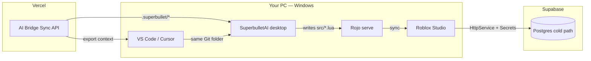

# KarLux stack line — VS Code → SuperbulletAI → Roblox Studio

**Product:** Palm Springs Paradise (Roblox game)  
**Control plane (cloud):** Vercel — **AI Bridge Sync** (`55-_AI_Intergration`)  
**Data (cold path):** Supabase Postgres  
**Game code (truth):** [Gemini-discovers-Diamonds](https://github.com/OBHitting3/Gemini-discovers-Diamonds) · branch `cursor/karlux-foundation-292d` · [PR #24](https://github.com/OBHitting3/Gemini-discovers-Diamonds/pull/24)

---

## The line (what you described)



| Hop | Tool | Role |
|-----|------|------|
| 1 | **VS Code / Cursor** | Edit Luau, Rojo extension, Git, tasks |
| 2 | **SuperbulletAI** | AI generates/patches Roblox code in `src/` ([superbullet.ai](https://superbullet.ai)) |
| 3 | **Rojo** | `rojo serve` → live sync into Studio |
| 4 | **Roblox Studio** | Play Solo, publish, Secrets for Supabase |
| — | **Vercel** | Hosts bridge dashboard + `/api/sync` + `/api/export/superbullet` |
| — | **Supabase** | Plot layouts, garden events, fashion results (cold path) |

---

## My role (Cloud Agent / Cursor) — what I do vs what you do

### I am responsible to **finish in code** (repo / Vercel config)

| Deliverable | Status |
|-------------|--------|
| AI Bridge Sync Next.js app + Vercel `vercel.json` | In `55-_AI_Intergration` |
| `/api/sync` — push context to Cursor, Claude, Gemini, **Superbullet** | Done |
| `/api/export/superbullet` — files for `.superbullet/` in game repo | Done |
| `scripts/pull-bridge-export.ps1` — pull export onto your PC | Done |
| Supabase SQL migration scaffold | In Gemini PR #24 `staging/supabase/` |
| Roblox `SupabaseClient.lua` + mock Play Solo | In Gemini `src/shared/` |
| PRD blueprint, Windows install docs | `docs/karlux/` |
| karl-twin optional loop (Pixel approval + RTX voice) | `karl-twin/` |

### I **cannot** do on your machine (you + Eddie/Karl)

| Step | Who |
|------|-----|
| Install **SuperbulletAI** for Windows | You |
| Install **Roblox Studio** + Rojo plugin | You |
| `rokit install` / `verify.ps1` on PalmSprings repo | You |
| Create **Supabase project** + run migrations | You / Manus |
| **Vercel** `vercel link` + env vars + deploy | You |
| Roblox **Secrets** (`SUPABASE_URL`, `SUPABASE_ANON_KEY`) | Karl / Studio |
| Merge **PR #24** and day-phase slice | Karl / Eddie |
| Publish game to Creator Hub | Karl / Eddie |

**Bottom line:** I set up the **pipes and docs**; you run the installers and connect accounts so the game actually runs in Studio.

---

## One-time setup (your Windows PC)

### A. Game repo (Palm Springs)

```powershell
cd $env:USERPROFILE\Documents\Roblox\PalmSprings   # clone per HANDOFF
git checkout cursor/karlux-foundation-292d
irm https://raw.githubusercontent.com/rojo-rbx/rokit/main/scripts/install.ps1 | iex
Copy-Item staging\toolchain\rokit.toml . -Force
Copy-Item staging\toolchain\wally.toml . -Force
rokit install
wally install
powershell -ExecutionPolicy Bypass -File staging\scripts\krlx-workspace-bootstrap.ps1
```

Install **SuperbulletAI**: https://superbullet.ai/downloads  
Open the **same** `PalmSprings` folder in SuperbulletAI and in Cursor.

### B. Vercel (bridge)

```powershell
cd path\to\55-_AI_Intergration
npm install
copy .env.local.example .env.local
# Edit DASHBOARD_PASSWORD, DEFAULT_GLOBAL_CONTEXT, BRIDGE_URL after deploy
npx vercel link
npx vercel env pull .env.local
npx vercel deploy --prod
```

Set in Vercel project settings:

| Variable | Purpose |
|----------|---------|
| `DASHBOARD_PASSWORD` | Protect `/` dashboard |
| `DEFAULT_GLOBAL_CONTEXT` | Palm Springs rules text for all AIs |
| `SUPABASE_URL` | Optional: server-side health only |
| `SUPABASE_SERVICE_ROLE_KEY` | **Server only** — never in Roblox client |

### C. Supabase

1. Create project at https://supabase.com/dashboard  
2. Run SQL from `staging/supabase/migrations/20260522000000_psp_cold_path.sql`  
3. Copy **anon** key → Roblox Secrets (Studio)  
4. Play Solo without secrets = mock mode (OK for dev)

### D. Connect the line daily

```powershell
# 1. Pull AI context into game repo
$env:BRIDGE_URL = "https://YOUR-APP.vercel.app"
powershell -ExecutionPolicy Bypass -File scripts\pull-bridge-export.ps1

# 2. Cursor: Task → Rojo: Serve
# 3. SuperbulletAI: same folder — prompt for features
# 4. Studio: Rojo Connect → Play → /status
```

---

## VS Code extensions (same as Cursor)

From Gemini PR #24 `.vscode/extensions.json`:

- Luau LSP  
- Rojo  
- StyLua  
- Selene  

---

## What “a game” means for v1 shippable

| Layer | Minimum to call it “playing” |
|-------|------------------------------|
| Studio | Place loads, `/claimplot 1`, `/coins 5000`, `/status` |
| Loop | Economy + plot + garden OR fashion (pick vertical slice) |
| Data | DataStore profiles work in Play Solo |
| Cloud | Supabase mock OK; live when Secrets set |
| AI line | Superbullet can edit `src/` without breaking Rojo sync |

Follow `docs/karlux/PRD-BLUEPRINT.md` to lock scope, then merge PR #24 + vertical slice per `03-vertical-slice-merge-guide.md`.

---

## Troubleshooting

| Symptom | Fix |
|---------|-----|
| Superbullet changes not in Studio | `rojo serve` running + Studio connected |
| Supabase errors in game | Add Secrets or accept mock mode |
| Bridge export 401 | Set `DASHBOARD_PASSWORD` / login to dashboard first |
| `rojo build` fails | Use **serve** only (class conflict) |

---

## Links

- SuperbulletAI: https://superbullet.ai  
- PR #24: https://github.com/OBHitting3/Gemini-discovers-Diamonds/pull/24  
- Windows install: `docs/karlux/07-step-by-step-install-windows.md` (in Gemini repo)
