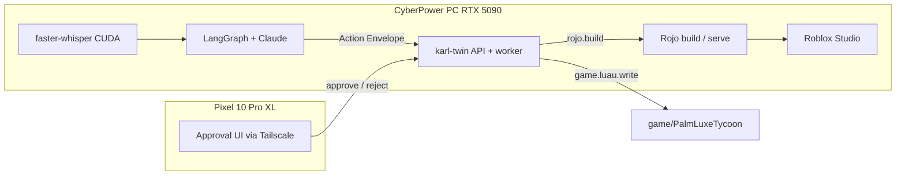

# Self-iterating Roblox pipeline (Palm Luxe Tycoon)

> **Palm Springs Paradise (production):** use repo [Gemini-discovers-Diamonds](https://github.com/OBHitting3/Gemini-discovers-Diamonds) branch `cursor/karlux-foundation-292d` with **Rokit** (not Aftman). Windows steps: `docs/PALM-SPRINGS-WINDOWS-CONTINUE.md` in this repo.

This folder (`game/PalmLuxeTycoon`) is a **prototype economy slice** in `55-_ai_intergration`. It wires **karl-twin** (approval-gated AI agent) to **Rojo** for safe, human-in-the-loop iteration.

## MCP reality check

| MCP server | Useful for Roblox? |
|------------|------------------|
| Firebase, Azure, Linear, Slack, Datadog, Figma | **No** — none expose Roblox Studio, Luau, or Open Cloud |
| **karl-twin** (this repo) | **Yes** — self-iteration loop with Pixel approval UI |

There is **no Roblox MCP** in the current Cursor environment. The best available control plane is **karl-twin** plus **Rojo**. For publish/CI you can add [Roblox Open Cloud](https://create.roblox.com/docs/cloud) API keys later (`ROBLOX_API_KEY` in `karl-twin/.env`).

## Architecture



**Loop:** voice/text intent → plan → propose `game.luau.write` → **you approve on Pixel** → worker patches Luau → `rojo.build` → open/sync in Studio → playtest → next iteration.

## One-shot install (your Windows machine)

From the **repository root**, in **Administrator PowerShell**:

```powershell
Set-ExecutionPolicy -Scope Process Bypass
.\karl-twin\infra\scripts\install-game-pipeline.ps1
```

Then edit `karl-twin\.env`:

| Variable | Required | Purpose |
|----------|----------|---------|
| `ANTHROPIC_API_KEY` | Yes | Planner / interpreter |
| `E2B_API_KEY` | Yes | Sandboxed Python execution |
| `GAME_ROOT` | Auto-set by install script | Path to `game\PalmLuxeTycoon` |
| `ROBLOX_API_KEY` | No (v0.1) | Open Cloud publish automation |
| `ROBLOX_UNIVERSE_ID` / `ROBLOX_PLACE_ID` | No | Target universe/place |

Start the stack:

```powershell
.\karl-twin\infra\scripts\start.ps1
```

## Daily iteration

1. **Serve** (live sync into Studio):

   ```powershell
   cd game\PalmLuxeTycoon
   rojo serve
   ```

   In Studio: Rojo plugin → Connect.

2. **Propose a change** (from `karl-twin` with venv active):

   ```powershell
   python -m karl_twin "Increase STARTING_LC by 10% and run Monte Carlo validation notes in a comment"
   ```

3. **Approve** on Pixel at `http://<tailscale-or-lan-ip>:8000/`.

4. **Playtest** in Studio; in command bar: `require(game.ServerScriptService.MonteCarloSim):Run()`.

5. Repeat.

## Worker action types (Roblox)

| action_type | Effect |
|-------------|--------|
| `game.luau.write` | Patch `.luau` under `GAME_ROOT` only |
| `rojo.build` | Emit `out/PalmLuxeTycoon.rbxlx` |
| `luau.lint` | Run Selene (optional strict mode) |

All require **tier ≤ 1 approval** by default (human approves each change on Pixel).

## Hardware notes

- **RTX 5090:** `WHISPER_DEVICE=cuda` and Docker GPU check in `bootstrap.ps1` — used for voice → text, not Roblox rendering.
- **Pixel 10 Pro XL:** Tailscale + Chrome to approval UI; no Roblox Studio on phone.

## What is still missing (gaps)

1. **Roblox Studio** — install from [Create](https://www.roblox.com/create); not scriptable via winget everywhere.
2. **Rojo Studio plugin** — [Installation guide](https://rojo.space/docs/v7/getting-started/installation/).
3. **Universe / Places** — this repo ships **Luau source only**, not `.rbxl` place files or 6 mode places; create places in Creator Hub and save IDs to `.env`.
4. **Roblox MCP** — not available in Cursor; Open Cloud REST is the automation surface if you add a custom MCP later.
5. **Automated playtest** — no headless Roblox runner in v0.1; validation is Studio + `MonteCarloSim`.
6. **ProfileService package** — README mentions the pattern; implementation uses raw `DataStoreService` (no Wally vendor yet).
7. **Cloud agent** — cannot run Studio or your GPU host; run `install-game-pipeline.ps1` locally.

## Linux / CI validation only

```bash
./game/scripts/validate.sh
```

Builds with Rojo and runs Selene when tools are on `PATH` (e.g. after `aftman install`).
